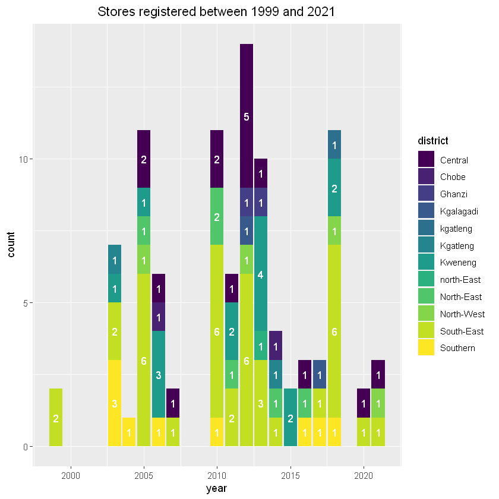

# Choppies Stores

## Summary


```R
#Choppies.csv
choppies <- read.csv("choppies.csv")
```


```R
choppies$Name <- as.character(choppies$Name )
choppies$Address <- as.character(choppies$Address)
choppies$Date <- as.Date(choppies$Date, "%d/%m/%Y")
```


```R
names(choppies) <- tolower(names(choppies))
```


```R
str(choppies)
```

    'data.frame':	108 obs. of  10 variables:
     $ name      : chr  "Choppies Bobonong" "Choppies Letlhakane" "Choppies Mahalapye" "Choppies Mahalapye" ...
     $ district  : chr  "Central" "Central" "Central" "Central" ...
     $ town      : chr  "Bobonong" "Letlhakane" "Mahalapye" "Mahalapye" ...
     $ address   : chr  "Moilamba Ward,Cash Bazaar building" "Nkosho Ward,Letlhakane" "Plot 6042, Main Mall, Mahalapye" "Watershed Mall, A1,  Mahalapye" ...
     $ latitude  : num  -22 -21.4 -23.1 -23.1 NA ...
     $ longitude : num  28.4 25.6 26.8 26.8 NA ...
     $ date      : Date, format: "2012-09-12" "2007-10-12" ...
     $ cancelled : logi  NA NA NA NA NA NA ...
     $ registered: chr  "Y" "Y" "Y" "Y" ...
     $ store     : chr  "choppies" "choppies" "choppies" "choppies" ...
    


```R
summary(choppies)
```


         Name             District             Town             Address         
     Length:108         Length:108         Length:108         Length:108        
     Class :character   Class :character   Class :character   Class :character  
     Mode  :character   Mode  :character   Mode  :character   Mode  :character  
                                                                                
                                                                                
                                                                                
                                                                                
        latitude        longitude         Date           Cancelled     
     Min.   :-26.02   Min.   :21.64   Length:108         Mode:logical  
     1st Qu.:-24.66   1st Qu.:25.55   Class :character   NA's:108      
     Median :-24.61   Median :25.87   Mode  :character                 
     Mean   :-23.48   Mean   :25.81                                    
     3rd Qu.:-21.98   3rd Qu.:26.11                                    
     Max.   :-17.80   Max.   :28.42                                    
     NA's   :29       NA's   :29                                       
      Registered           Store          
     Length:108         Length:108        
     Class :character   Class :character  
     Mode  :character   Mode  :character  
                                          
                                          
                                          
                                          


## Number of Stores and Locations


```R
library(dplyr)
library(tidyverse)
```

    -- Attaching packages --------------------------------------- tidyverse 1.3.1 --
    
    v ggplot2 3.3.6     v purrr   0.3.4
    v tibble  3.1.7     v stringr 1.4.0
    v tidyr   1.2.0     v forcats 0.5.1
    v readr   2.1.2     
    
    -- Conflicts ------------------------------------------ tidyverse_conflicts() --
    x dplyr::filter() masks stats::filter()
    x dplyr::lag()    masks stats::lag()
    
    

South-East region contains the highest number of stores followed by Kweneng and Central districts. Combined, the the three districts contain 71% of the total stores in the country. 


```R
district_summary <- choppies %>% 
group_by(district) %>% 
summarise(n = n()) %>% 
mutate(percent = round(100*n/sum(n),2)) %>%
arrange(desc(n)) %>%
mutate(cum_per = cumsum(percent)) %>%
head()

district_summary
```


<table class="dataframe">
<caption>A tibble: 6 × 4</caption>
<thead>
	<tr><th scope=col>district</th><th scope=col>n</th><th scope=col>percent</th><th scope=col>cum_per</th></tr>
	<tr><th scope=col>&lt;chr&gt;</th><th scope=col>&lt;int&gt;</th><th scope=col>&lt;dbl&gt;</th><th scope=col>&lt;dbl&gt;</th></tr>
</thead>
<tbody>
	<tr><td>South-East</td><td>42</td><td>38.89</td><td>38.89</td></tr>
	<tr><td>Kweneng   </td><td>18</td><td>16.67</td><td>55.56</td></tr>
	<tr><td>Central   </td><td>17</td><td>15.74</td><td>71.30</td></tr>
	<tr><td>Southern  </td><td> 9</td><td> 8.33</td><td>79.63</td></tr>
	<tr><td>North-East</td><td> 7</td><td> 6.48</td><td>86.11</td></tr>
	<tr><td>North-West</td><td> 4</td><td> 3.70</td><td>89.81</td></tr>
</tbody>
</table>


```R
top_3 <- district_summary %>%
top_n(3) %>%
select(district) %>%
pull()

top_3
```

    Selecting by percent
    


<style>
.list-inline {list-style: none; margin:0; padding: 0}
.list-inline>li {display: inline-block}
.list-inline>li:not(:last-child)::after {content: "\00b7"; padding: 0 .5ex}
</style>
<ol class=list-inline><li>'South-East'</li><li>'Kweneng'</li><li>'Central'</li></ol>


```R
top_district <- choppies %>% 
select(district,town) %>%
filter(district %in% top_3) %>%
group_by(district,town) %>%
arrange(district) %>%
distinct()

```

Listing the towns in the top districts and the number of stores in the top towns.


```R

pivot_wider(top_district, names_from = district, values_from = town, values_fn = list)
```


<table class="dataframe">
<caption>A tibble: 1 × 3</caption>
<thead>
	<tr><th scope=col>Central</th><th scope=col>Kweneng</th><th scope=col>South-East</th></tr>
	<tr><th scope=col>&lt;list&gt;</th><th scope=col>&lt;list&gt;</th><th scope=col>&lt;list&gt;</th></tr>
</thead>
<tbody>
	<tr><td>Bobonong  , Letlhakane, Mahalapye , Palapye   , Phikwe    , Serowe    , Shoshong  , Sebina    , Tonota    , Tutume    , Nata      </td><td>Gabane       , Mogoditshane , Metsimotlhabe, Molepolole   , Letlhakeng   , Thamaga      , Thebephatswa </td><td>Gaborone   , Phakalane  , Tlokweng   , Lobatse    , Ramotswa   , Glen Valley</td></tr>
</tbody>
</table>


```R
top_towns_n <- choppies %>% group_by(town) %>% 
summarise(n = n()) %>% 
arrange(desc(n)) %>%
top_n(10) 

top_towns_n
```

    Selecting by n
    


<table class="dataframe">
<caption>A tibble: 10 × 2</caption>
<thead>
	<tr><th scope=col>town</th><th scope=col>n</th></tr>
	<tr><th scope=col>&lt;chr&gt;</th><th scope=col>&lt;int&gt;</th></tr>
</thead>
<tbody>
	<tr><td>Gaborone    </td><td>28</td></tr>
	<tr><td>Mogoditshane</td><td> 9</td></tr>
	<tr><td>Francistown </td><td> 7</td></tr>
	<tr><td>Lobatse     </td><td> 7</td></tr>
	<tr><td>Mahalapye   </td><td> 3</td></tr>
	<tr><td>Maun        </td><td> 3</td></tr>
	<tr><td>Molepolole  </td><td> 3</td></tr>
	<tr><td>Palapye     </td><td> 3</td></tr>
	<tr><td>Ramotswa    </td><td> 3</td></tr>
	<tr><td>Tlokweng    </td><td> 3</td></tr>
</tbody>
</table>


```R
top_towns <- top_towns_n %>%
select(town) %>%
pull()

top_towns
```


<style>
.list-inline {list-style: none; margin:0; padding: 0}
.list-inline>li {display: inline-block}
.list-inline>li:not(:last-child)::after {content: "\00b7"; padding: 0 .5ex}
</style>
<ol class=list-inline><li>'Gaborone'</li><li>'Mogoditshane'</li><li>'Francistown'</li><li>'Lobatse'</li><li>'Mahalapye'</li><li>'Maun'</li><li>'Molepolole'</li><li>'Palapye'</li><li>'Ramotswa'</li><li>'Tlokweng'</li></ol>


### Choppies By Year

Choppies saw the largest growth between 2005 and 2013. Between these years, South-East, Kweneng and Central saw the high number of stores.


```R
choppies$month <- months(choppies$date)
choppies$year <- as.numeric(format(choppies$date, "%Y"))
```


```R
str(choppies)
```

    'data.frame':	108 obs. of  12 variables:
     $ name      : chr  "Choppies Bobonong" "Choppies Letlhakane" "Choppies Mahalapye" "Choppies Mahalapye" ...
     $ district  : chr  "Central" "Central" "Central" "Central" ...
     $ town      : chr  "Bobonong" "Letlhakane" "Mahalapye" "Mahalapye" ...
     $ address   : chr  "Moilamba Ward,Cash Bazaar building" "Nkosho Ward,Letlhakane" "Plot 6042, Main Mall, Mahalapye" "Watershed Mall, A1,  Mahalapye" ...
     $ latitude  : num  -22 -21.4 -23.1 -23.1 NA ...
     $ longitude : num  28.4 25.6 26.8 26.8 NA ...
     $ date      : Date, format: "2012-09-12" "2007-10-12" ...
     $ cancelled : logi  NA NA NA NA NA NA ...
     $ registered: chr  "Y" "Y" "Y" "Y" ...
     $ store     : chr  "choppies" "choppies" "choppies" "choppies" ...
     $ month     : chr  "September" "October" "January" NA ...
     $ year      : num  2012 2007 2012 NA 2012 ...
    


```R
choppies %>% 
filter(!is.na(year)) %>%
group_by(year) %>%
summarise(n = n()) %>%
arrange(year) 
```


<table class="dataframe">
<caption>A tibble: 17 × 2</caption>
<thead>
	<tr><th scope=col>year</th><th scope=col>n</th></tr>
	<tr><th scope=col>&lt;dbl&gt;</th><th scope=col>&lt;int&gt;</th></tr>
</thead>
<tbody>
	<tr><td>1999</td><td> 2</td></tr>
	<tr><td>2003</td><td> 7</td></tr>
	<tr><td>2004</td><td> 1</td></tr>
	<tr><td>2005</td><td>11</td></tr>
	<tr><td>2006</td><td> 6</td></tr>
	<tr><td>2007</td><td> 2</td></tr>
	<tr><td>2010</td><td>11</td></tr>
	<tr><td>2011</td><td> 6</td></tr>
	<tr><td>2012</td><td>14</td></tr>
	<tr><td>2013</td><td>10</td></tr>
	<tr><td>2014</td><td> 4</td></tr>
	<tr><td>2015</td><td> 2</td></tr>
	<tr><td>2016</td><td> 3</td></tr>
	<tr><td>2017</td><td> 3</td></tr>
	<tr><td>2018</td><td>11</td></tr>
	<tr><td>2020</td><td> 2</td></tr>
	<tr><td>2021</td><td> 3</td></tr>
</tbody>
</table>


```R
choppies %>% filter(!is.na(year)) %>%
filter(between(year,2005,2013)) %>%
group_by(year, district) %>%
summarise(n = n()) %>%
arrange(desc(n)) %>%
head()

```

    `summarise()` has grouped output by 'year'. You can override using the
    `.groups` argument.
    


<table class="dataframe">
<caption>A grouped_df: 6 × 3</caption>
<thead>
	<tr><th scope=col>year</th><th scope=col>district</th><th scope=col>n</th></tr>
	<tr><th scope=col>&lt;dbl&gt;</th><th scope=col>&lt;chr&gt;</th><th scope=col>&lt;int&gt;</th></tr>
</thead>
<tbody>
	<tr><td>2005</td><td>South-East</td><td>6</td></tr>
	<tr><td>2010</td><td>South-East</td><td>6</td></tr>
	<tr><td>2012</td><td>South-East</td><td>6</td></tr>
	<tr><td>2012</td><td>Central   </td><td>5</td></tr>
	<tr><td>2013</td><td>Kweneng   </td><td>4</td></tr>
	<tr><td>2006</td><td>Kweneng   </td><td>3</td></tr>
</tbody>
</table>


```R
library(ggplot2)
library(viridis)
```

    Loading required package: viridisLite
    
    


```R
c <- choppies %>% 
filter(!is.na(year)) %>%
select(district,year) 

df <- data.frame(c)
df$district <- factor(df$district)
str(df)

```

    'data.frame':	98 obs. of  2 variables:
     $ district: Factor w/ 12 levels "Central","Chobe",..: 1 1 1 1 1 1 1 1 1 1 ...
     $ year    : num  2012 2007 2012 2012 2005 ...
    


```R
freq <- df %>%
group_by(district, year) %>%
mutate(freq = n())
```


```R
ggplot(df,aes(year,fill = district)) + 
geom_bar() +
ggtitle("Stores registered between 1999 and 2021") +
theme(plot.title = element_text(hjust = 0.5)) +
 geom_text(aes(label = after_stat(count)), stat = "count", 
           position = position_stack(vjust = 0.5),
           color = "white") + 
scale_fill_viridis(discrete = TRUE)

```


    

    

