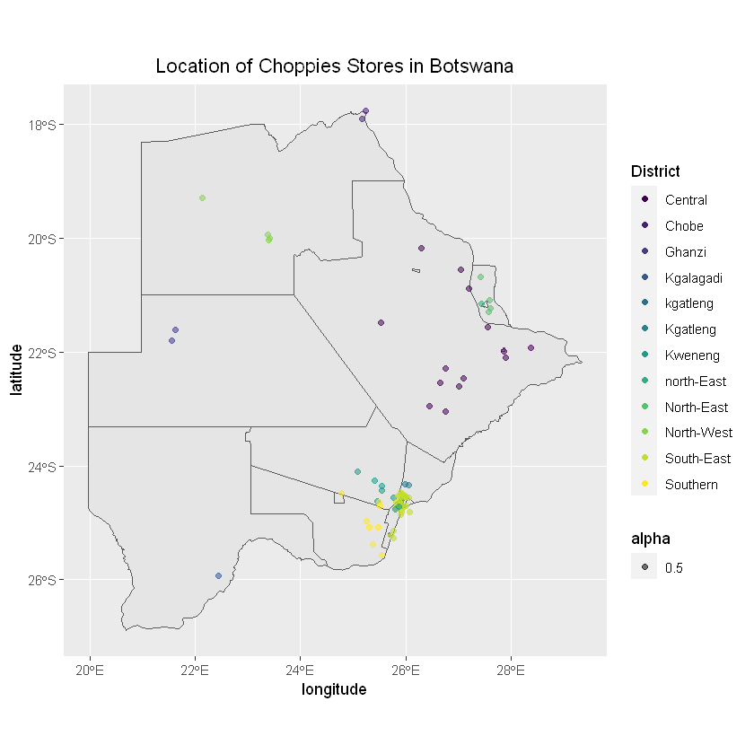
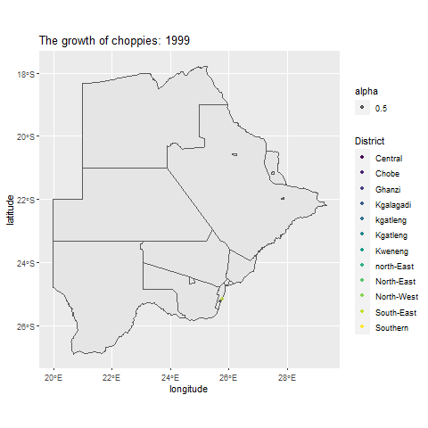

## Choppies in Botswana

### Data Summary


```R
choppies <- read.csv("choppies.csv")
```


```R
choppies$Date <- as.Date(choppies$Date, "%d/%m/%Y")
choppies$year <- as.numeric(format(choppies$Date, "%Y"))
choppies$District <- factor(choppies$District)
```


```R
str(choppies)
```

    'data.frame':	108 obs. of  11 variables:
     $ Name      : chr  "Choppies Bobonong" "Choppies Letlhakane" "Choppies Mahalapye" "Choppies Mahalapye" ...
     $ District  : Factor w/ 13 levels "Central","Chobe",..: 1 1 1 1 1 1 1 1 1 1 ...
     $ Town      : chr  "Bobonong" "Letlhakane" "Mahalapye" "Mahalapye" ...
     $ Address   : chr  "Moilamba Ward,Cash Bazaar building" "Nkosho Ward,Letlhakane" "Plot 6042, Main Mall, Mahalapye" "Watershed Mall, A1,  Mahalapye" ...
     $ latitude  : num  -22 -21.4 -23.1 -23.1 NA ...
     $ longitude : num  28.4 25.6 26.8 26.8 NA ...
     $ Date      : Date, format: "2012-09-12" "2007-10-12" ...
     $ Cancelled : logi  NA NA NA NA NA NA ...
     $ Registered: chr  "Y" "Y" "Y" "Y" ...
     $ Store     : chr  "choppies" "choppies" "choppies" "choppies" ...
     $ year      : num  2012 2007 2012 NA 2012 ...
    


```R
summary(choppies)
```


         Name                 District      Town             Address         
     Length:108         South-East:42   Length:108         Length:108        
     Class :character   Kweneng   :18   Class :character   Class :character  
     Mode  :character   Central   :17   Mode  :character   Mode  :character  
                        Southern  : 9                                        
                        North-East: 7                                        
                        North-West: 4                                        
                        (Other)   :11                                        
        latitude        longitude          Date            Cancelled     
     Min.   :-26.02   Min.   :21.64   Min.   :1999-11-02   Mode:logical  
     1st Qu.:-24.66   1st Qu.:25.55   1st Qu.:2006-03-16   NA's:108      
     Median :-24.61   Median :25.87   Median :2012-06-22                 
     Mean   :-23.48   Mean   :25.81   Mean   :2011-09-14                 
     3rd Qu.:-21.98   3rd Qu.:26.11   3rd Qu.:2014-10-28                 
     Max.   :-17.80   Max.   :28.42   Max.   :2021-10-28                 
     NA's   :29       NA's   :29      NA's   :10                         
      Registered           Store                year     
     Length:108         Length:108         Min.   :1999  
     Class :character   Class :character   1st Qu.:2006  
     Mode  :character   Mode  :character   Median :2012  
                                           Mean   :2011  
                                           3rd Qu.:2014  
                                           Max.   :2021  
                                           NA's   :10    


### Choppies Map


```R
library(dplyr)
```

Removing NAs...


```R
choppies_map <- choppies %>% 
filter(!is.na(longitude),!is.na(latitude), !is.na(Date)) %>%
data.frame
```


```R
str(choppies_map)
```

    'data.frame':	74 obs. of  11 variables:
     $ Name      : chr  "Choppies Bobonong" "Choppies Letlhakane" "Choppies Mahalapye" "Choppies Palapye" ...
     $ District  : Factor w/ 13 levels "Central","Chobe",..: 1 1 1 1 1 1 1 1 1 1 ...
     $ Town      : chr  "Bobonong" "Letlhakane" "Mahalapye" "Palapye" ...
     $ Address   : chr  "Moilamba Ward,Cash Bazaar building" "Nkosho Ward,Letlhakane" "Plot 6042, Main Mall, Mahalapye" "Makwapa complex,Serorome Ward,Palapye" ...
     $ latitude  : num  -22 -21.4 -23.1 -22.5 -22.5 ...
     $ longitude : num  28.4 25.6 26.8 27.1 27.1 ...
     $ Date      : Date, format: "2012-09-12" "2007-10-12" ...
     $ Cancelled : logi  NA NA NA NA NA NA ...
     $ Registered: chr  "Y" "Y" "Y" "Y" ...
     $ Store     : chr  "choppies" "choppies" "choppies" "choppies" ...
     $ year      : num  2012 2007 2012 2005 2020 ...
    


```R
summary(choppies_map)
```


         Name                 District      Town             Address         
     Length:74          South-East:24   Length:74          Length:74         
     Class :character   Central   :14   Class :character   Class :character  
     Mode  :character   Kweneng   :12   Mode  :character   Mode  :character  
                        Southern  : 8                                        
                        North-East: 4                                        
                        North-West: 4                                        
                        (Other)   : 8                                        
        latitude        longitude          Date            Cancelled     
     Min.   :-26.02   Min.   :21.64   Min.   :1999-11-02   Mode:logical  
     1st Qu.:-24.66   1st Qu.:25.52   1st Qu.:2005-09-13   NA's:74       
     Median :-24.61   Median :25.88   Median :2011-08-06                 
     Mean   :-23.42   Mean   :25.80   Mean   :2010-12-12                 
     3rd Qu.:-21.97   3rd Qu.:26.13   3rd Qu.:2013-11-11                 
     Max.   :-17.80   Max.   :28.42   Max.   :2021-10-28                 
                                                                         
      Registered           Store                year     
     Length:74          Length:74          Min.   :1999  
     Class :character   Class :character   1st Qu.:2005  
     Mode  :character   Mode  :character   Median :2011  
                                           Mean   :2010  
                                           3rd Qu.:2013  
                                           Max.   :2021  
                                                         


```R
library(sf)
library(rnaturalearth)
library(rnaturalearthdata)
library(ggplot2)
library(plotly)
library(viridis)
```


```R
#install.packages("devtools") # I guess you also need this
#devtools::install_github("ropensci/rnaturalearthhires")
library("rnaturalearth")
```


```R
BW_states <- ne_states(country = 'botswana', returnclass = 'sf')
#str(BW_states)
```


```R
set.seed(3)
ggplot(data = BW_states) + geom_sf() +
geom_jitter(data = choppies_map, 
           mapping=aes(x = longitude, y = latitude, 
               colour = District, alpha = 0.5), 
            width = 0.1, height = 0.15) +
ggtitle("Location of Choppies Stores in Botswana" ) +
theme(plot.title = element_text(hjust = 0.5)) +
scale_color_viridis_d()

#ggplotly(g)
```


    

    


### Choppies Animated


```R
library(gganimate)
library(gifski)
```

```R
num_years <- max(choppies_map$year) - min(choppies_map$year) + 1

map_with_animation <- map_with_data +
    transition_time(year) +
ggtitle('The growth of choppies: {frame_time}')

map_with_animation <- map_with_animation +
shadow_mark()


animate(map_with_animation, nframes = num_years, fps = 1)
anim_save('choppies_growth.gif')
```


